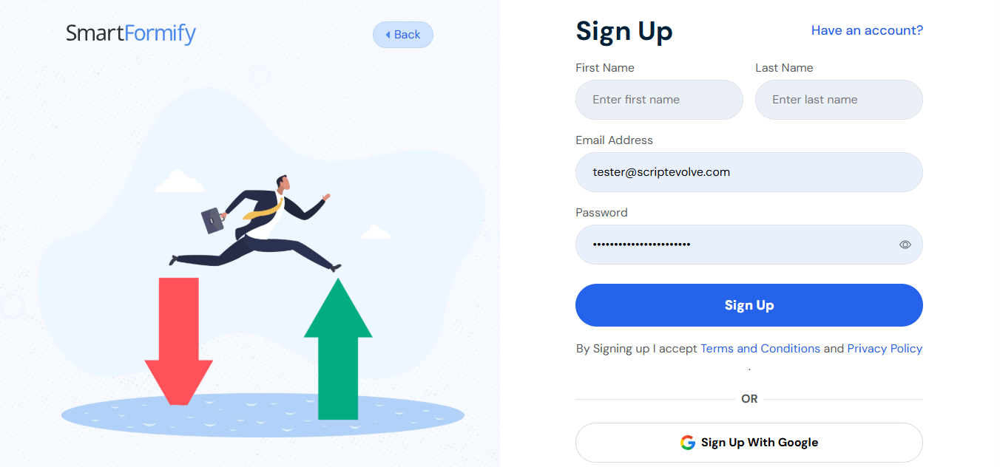
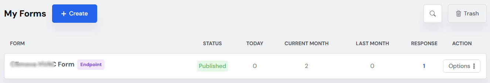
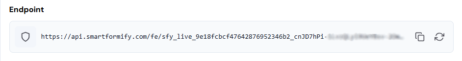
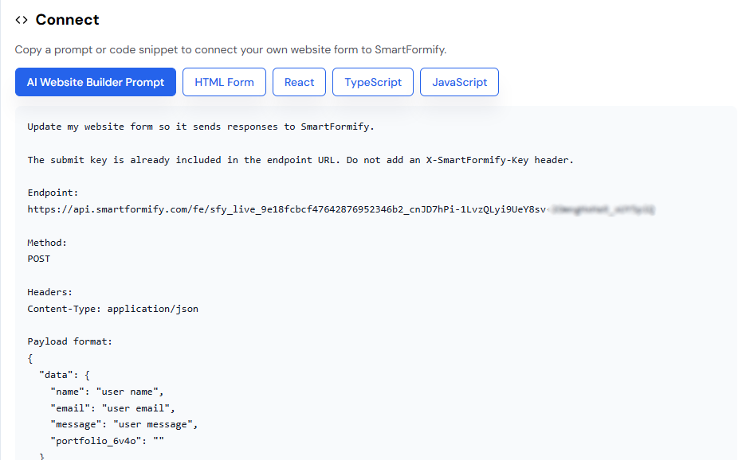
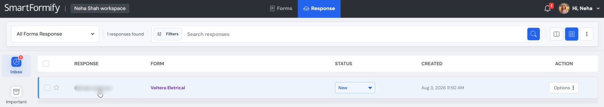

# Build Your Website by Using Codex and Connect Your Website Forms with Smartformify

> **A simple guide for websites created with Codex**
>
> If your contact form shows an error after your website is created, don't worry. This is normal. It only means your website doesn't yet have a place to receive visitor messages.
>
> In this guide, you'll connect your form to **Smartformify** so every message is received and stored safely.

---

# 📖 Broken vs. Fixed

## ❌ Part 1: The Initial Problem

Your website looks great.

Visitors can fill out your contact form.

But when they click **Submit**, an error appears or nothing happens.

Why?

Because the website has nowhere to send or save the message.

Without connecting a message receiver, every submission is lost.

> ⚠️ **Before**
>
> Your contact form cannot receive visitor messages.


---

## ✅ Part 2: The Solution

### Connect Smartformify

Think of **Smartformify** as your website's automated mailbox.

Instead of losing messages, every form submission is delivered to one organized inbox.

Once connected:

- ✅ Forms submit successfully
- ✅ Messages are stored safely
- ✅ Everything stays organized
- ✅ You can read every visitor message anytime

> 💡 **After**
>
> Your contact form works exactly as visitors expect.


---

# 🚀 Part 3: Step-by-Step Setup

## **Step 1 — Create Your Smartformify Account**

Create your free account.

👉 [Smartformify Sign Up](https://www.smartformify.com/signup)

After signing in, you'll see your main dashboard.



---

## **Step 2 — Copy Your Connection Link**

From your dashboard:

1. Open your **Smartformify Dashboard**
2. Click **Create an Endpoint**
3. Give your endpoint a name
4. Save it
5. Copy the **Endpoint URL**



This link tells your website where new messages should be delivered.



> 📋 **Tip**
>
> Every form has its own unique connection link.

---

## **Step 3 — Connect Your Website**

Choose whichever method is easier.

---

### Method A — Paste the Connection Link Yourself

Open the contact form in your website.

Replace the existing connection link with the one you copied from Smartformify.

Save your changes.

That's it.

> ✅ Your contact form is now connected.

---

### Method B — Let Codex Do It

If you created your website with Codex, you can simply ask it to make the change for you.

Copy and paste this prompt into Codex.

```


```

After Codex finishes, save the changes and test your contact form.

> 🤖 **Easy Option**
>
> If you're unsure where to paste the connection link, let Codex do it for you.

---

# 📬 Part 4: Read Your Visitor Messages

Once your website is connected:

1. Open Smartformify.
2. Go to your dashboard.
3. Open your Inbox.
4. Click any message to read it.



Every new form submission will appear automatically.

> 📥 **Your Inbox**
>
> All visitor messages are collected in one place, making them easy to read and manage.

---

# 🎉 You're Done!

Your website can now receive visitor messages.

Whenever someone fills out your contact form:

- ✅ The form submits successfully.
- ✅ The message is delivered automatically.
- ✅ You can read it from your Smartformify inbox.

Your contact form is now ready for real visitors.