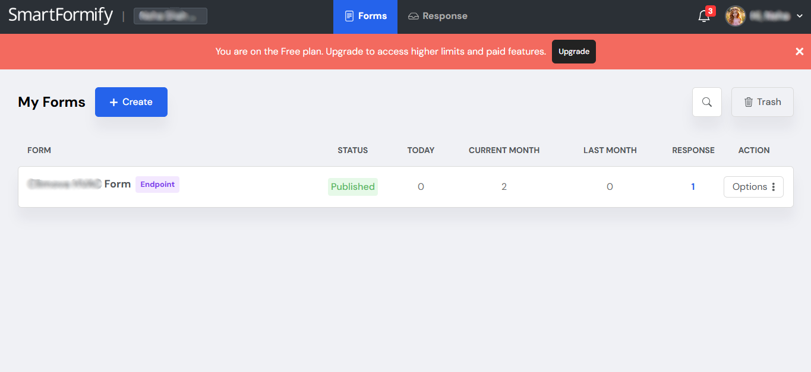

# ChatGPT Website + Smartformify

Welcome! This guide shows you how to make sure messages from your website reach you safely and automatically.

## About This Website

This website was created with help from an AI assistant such as ChatGPT. It uses **Smartformify** to collect contact-form messages, newsletter signups, booking requests, and other visitor responses.

Instead of sending messages to an email address on the page, Smartformify keeps them together in one private place for you to review whenever you are ready.

## How It Works

1. A visitor fills in a form on your website.
2. They select the form's send button.
3. Their answers are sent directly to your private Smartformify dashboard.
4. You can log in to view, manage, or export those responses.

## Step-by-Step Setup

### Step 1: Sign Up

1. Go to [Smartformify Sign Up](https://www.smartformify.com/signup).
2. Create your account and follow any on-screen instructions to confirm it.
3. Log in to your Smartformify dashboard.


### Step 2: Get Your Form Link (Endpoint URL)

1. Open your Smartformify dashboard.
2. Create a new **Endpoint**. Think of an Endpoint as the private address that receives messages from one form.
3. Copy the unique **Endpoint URL** shown for that Endpoint.
4. Keep this link handy—you will add it to your website in the next step.




### Step 3: Connect Your Website

Choose the option that feels most comfortable for you.

#### Option A: Add the Link Yourself

If you are editing the website form directly:

1. Find the contact or signup form in your website files.
2. Find the form's `action` field.
3. Paste your Smartformify Endpoint URL inside that field.
4. Save your changes and publish your website.

For example:

```html
<form action="PASTE-YOUR-SMARTFORMIFY-ENDPOINT-URL-HERE" method="POST">
```

#### Option B: Ask ChatGPT to Connect It

If ChatGPT helped create your website, you can ask it to add the Endpoint URL for you.

1. Copy your Smartformify Endpoint URL.
2. Copy the prompt below.
3. Paste both into ChatGPT in the same chat where your website was created.
4. Ask ChatGPT to update the website, then save and publish the updated version.

```text
Please connect the contact and signup forms on my website to Smartformify.

Use this Smartformify Endpoint URL:
PASTE-YOUR-SMARTFORMIFY-ENDPOINT-URL-HERE

For each form that should send visitor messages, put this URL in the form's action field and use POST when sending the form. Keep the current form design and fields unchanged. After updating it, show me exactly what you changed.
```


## Viewing Your Messages

Whenever someone submits a form on your website:

- Log in to Smartformify.
- Open the Endpoint connected to that form.
- Read each visitor response in your dashboard.
- Manage messages as needed and export them when you want a copy.

## Before You Share Your Website

- Submit a test message through every form yourself.
- Check that the test message appears in the right Smartformify Endpoint.
- Make sure the form includes a clear thank-you message after it is sent.

You're all set—your website can now collect messages while Smartformify keeps them organized for you.
