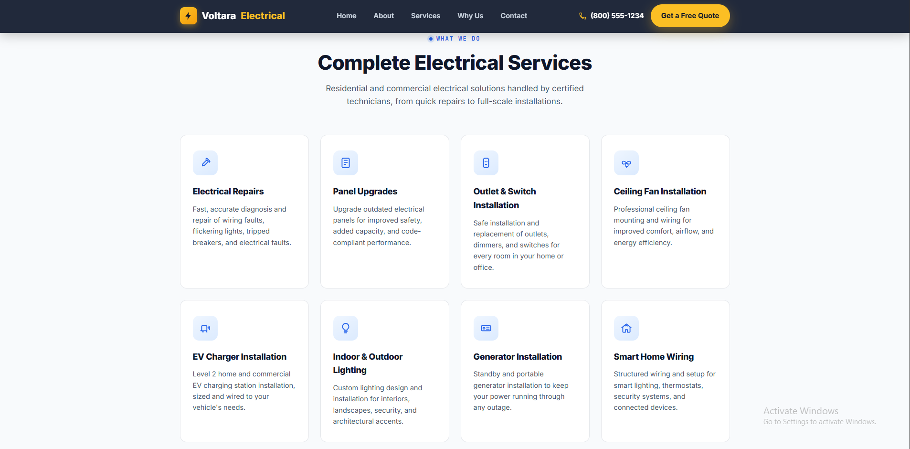
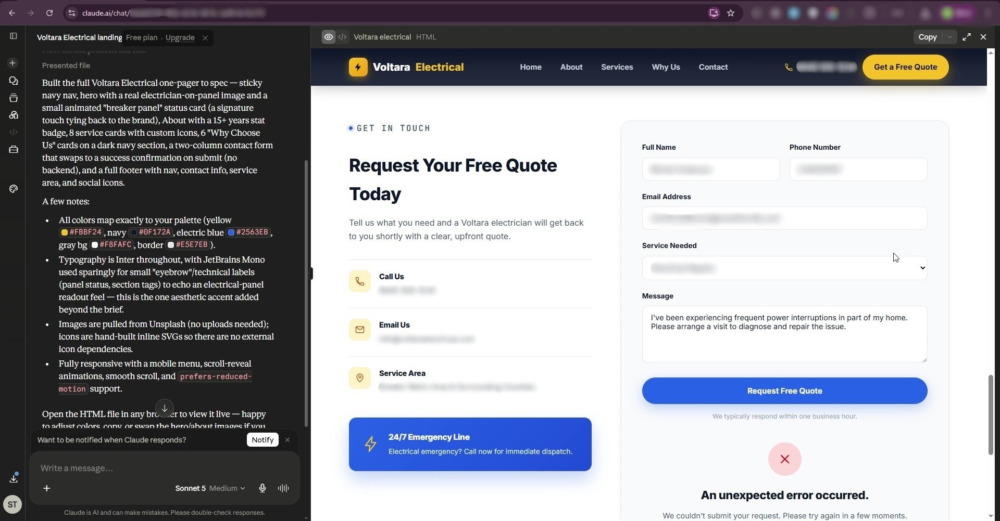
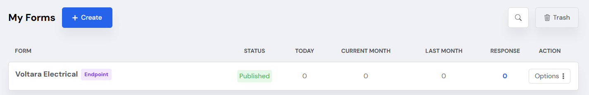
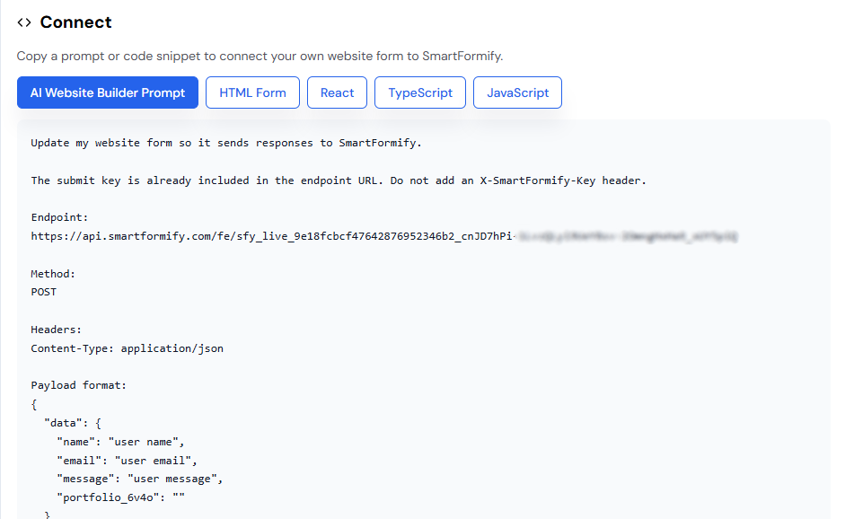
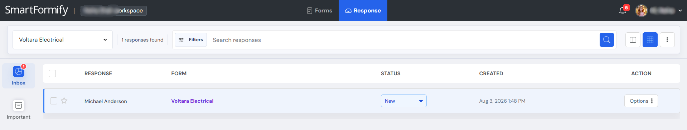

# Connect Your Claude AI-Built Website Forms to Smartformify

> Turn a contact or inquiry form into a working form in just a few minutes.

## Overview

This website was created with the help of an AI assistant, such as Claude. Its design and pages are ready, but its contact form still needs a destination for visitor messages.

<p align="center">
  <a href="./assets/website.png">
    
  </a>
  &nbsp;&nbsp;
  <a href="./assets/website-body.png">
    
  </a>
</p>

**Smartformify** provides that destination. Once connected, form submissions are received and stored in your Smartformify dashboard, where you can review and manage them.

## Before and After

### Before setup: form error

Before the form is connected, clicking **Submit** may show an error, do nothing, or fail to send the visitor's message.

[](./assets/form-error.jpg)

### After setup: successful submission

Once connected to Smartformify, visitors can submit messages and see a confirmation. Each submission is saved in your Smartformify dashboard.

[](./assets/form-success.png)

## Step-by-Step Setup Guide

### Step 1: Create a free Smartformify account

[Create your Smartformify account](https://www.smartformify.com/signup)

After signing up, you will have access to your dashboard, where your endpoints and responses are managed.

### Step 2: Create an endpoint and copy its URL

After logging in:

1. Open your **Smartformify Dashboard**.
2. Select **Create an Endpoint**.
3. Give the endpoint a name.
4. Save it.
5. Copy the **Endpoint URL**.

The Endpoint URL is the address your website uses to send visitor messages.

#### Dashboard

[](./assets/dashboard.png)

#### Endpoint URL

[](./assets/endpoint-url.png)

### Step 3: Connect your website form

Choose the option that feels most comfortable for you.

#### Option A: Connect manually

Replace your form's `action` value with the Smartformify Endpoint URL you copied:

```html
<form action="YOUR_SMARTFORMIFY_ENDPOINT_URL" method="POST">
```

Save your website after making the change.

#### Option B: Connect using AI

If you would rather not edit the code yourself, open your AI assistant and use the instructions shown below.

##### AI prompt

[](./assets/ai-prompt.png)

Your AI assistant can then update the form connection for you.

## View Your Form Responses

Whenever a visitor submits your website form, you will receive an email notification, and Smartformify will securely store the submission in your dashboard. From there, you can:

- View all contact form submissions
- Read and manage visitor messages
- Organize and follow up on responses
- Track new inquiries
- Manage all your website forms in one place

[](./assets/response-dashboard.png)

## You're All Set

Your website is ready to receive visitor messages. Each form submission will be sent to Smartformify, where you can view and manage responses from your dashboard.

Happy building!
