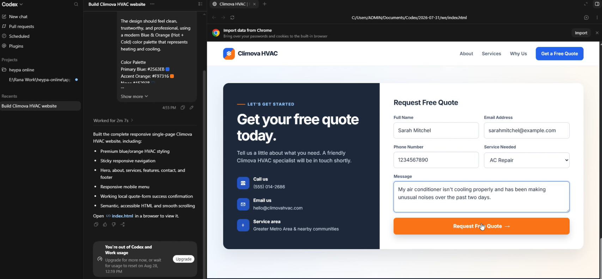
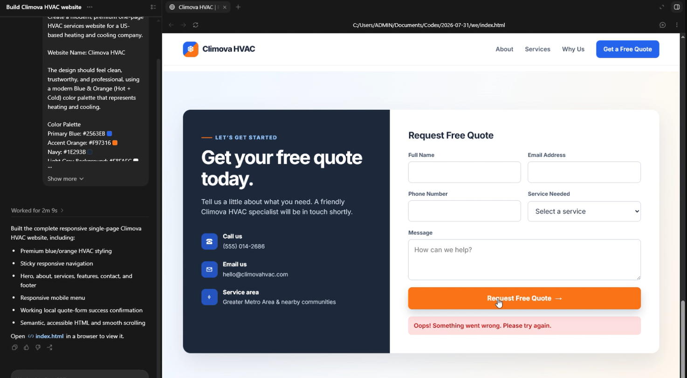
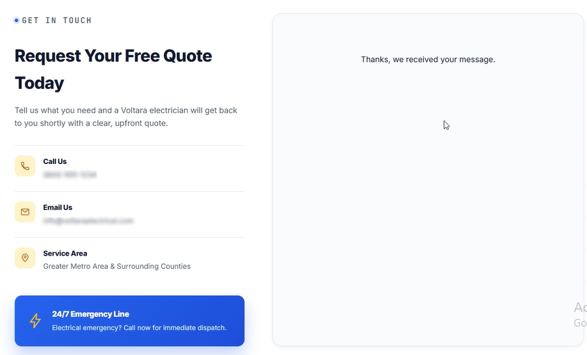
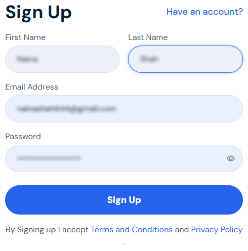
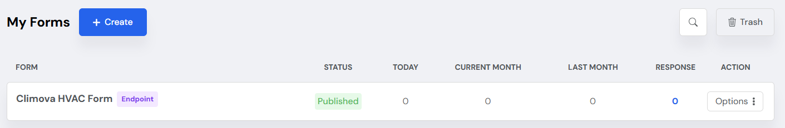
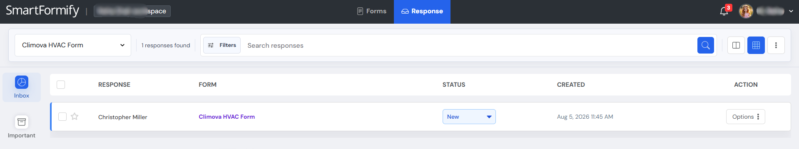

# Build Your Website with Codex + Smartformify

> **A simple, beginner-friendly guide for connecting an AI-generated website form to Smartformify.**

If your contact form shows an error after creating your website with Codex, don't worry. The form simply needs a place to send and store visitor messages.

This guide walks you through connecting your website form to **Smartformify** so submissions can be received and managed from one place.

---

## 📖 Before vs. After

### ❌ Before: The Form Doesn't Work

Your website may look complete, but visitors can still experience problems when they submit the contact form.

When someone clicks **Submit**, the form may:

- Show an error
- Do nothing
- Fail to send the message
- Lose the visitor's information

This happens because the form has not been connected to a destination yet.

> ⚠️ **Before Setup**
>
> The contact form is not connected, so visitor messages cannot be received.

---

### ✅ After: The Form Works

Connect your website form to **Smartformify** and your visitors can submit their messages successfully.

Once connected:

- ✅ Forms submit successfully
- ✅ Messages are received
- ✅ Submissions stay organized
- ✅ You can view visitor messages anytime

> 💡 **After Setup**
>
> Your contact form is connected and ready to receive visitor messages.

---

# 🚀 Step-by-Step Setup

## Step 1 — Create Your Smartformify Account

Create your free Smartformify account to get started.

**[👉 Sign Up for Smartformify](https://www.smartformify.com/signup)**

After signing in, you'll have access to your Smartformify dashboard.

---

## Step 2 — Create an Endpoint

From your Smartformify dashboard:

1. Open your **Smartformify Dashboard**
2. Click **Create an Endpoint**
3. Give your endpoint a name
4. Save it
5. Copy the **Endpoint URL**

The Endpoint URL is the connection link your website uses to send visitor messages to Smartformify.

> 📋 **Tip**
>
> Each form can use its own unique connection link.

---

## Step 3 — Connect Your Website Form

Choose the method that works best for you.

### Option A — Connect It Yourself

Open the contact form in your website and replace its existing connection link with the **Endpoint URL** you copied from Smartformify.

Save your changes and test the form.

> ✅ **That's it!**
>
> Your contact form is now connected to Smartformify.

---

### Option B — Ask Codex to Connect It

If you created the website with Codex, you can ask Codex to make the change for you.

Copy the prompt below and paste it into Codex.

After Codex finishes, save the changes and test your contact form.

> 🤖 **Easy Option**
>
> If you're not sure where to add the connection link, let Codex handle the change for you.

---

# 📬 View Your Visitor Messages

Once your website form is connected:

1. Open Smartformify
2. Go to your dashboard
3. Open your inbox
4. Select a message to read it

New form submissions will appear automatically.

> 📥 **Your Messages, Organized**
>
> Keep visitor messages in one place so they're easy to read and manage.

---

# 🎉 You're All Set!

Your website is now ready to receive visitor messages.

When someone submits your contact form:

- ✅ The form submits successfully
- ✅ The message is delivered automatically
- ✅ You can view it from your Smartformify dashboard

**Your contact form is ready for real visitors.**
