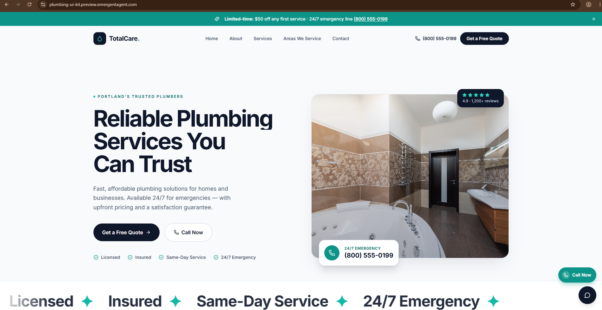
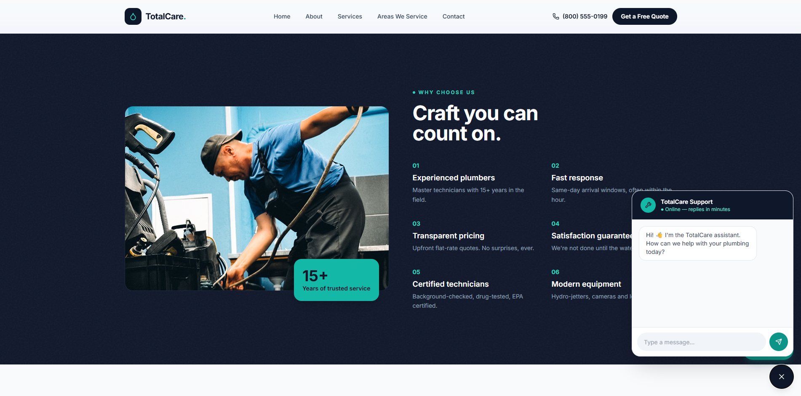
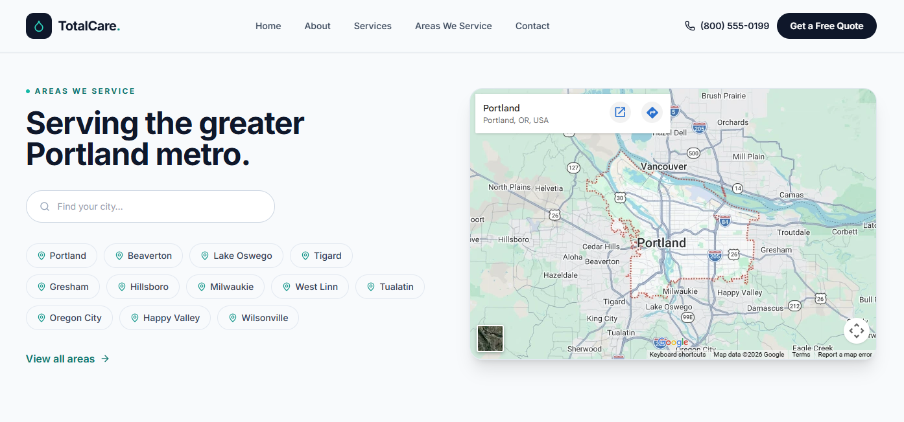
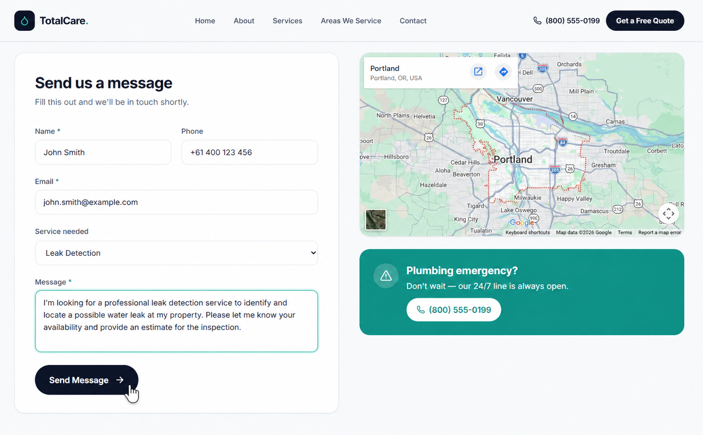
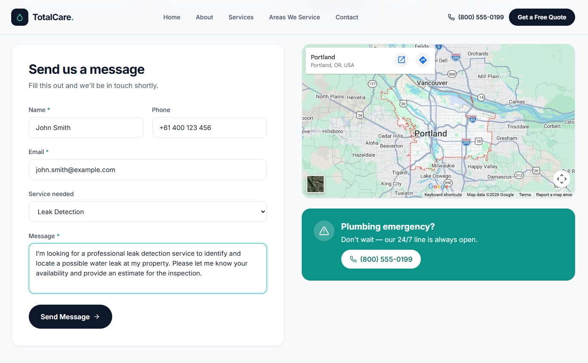
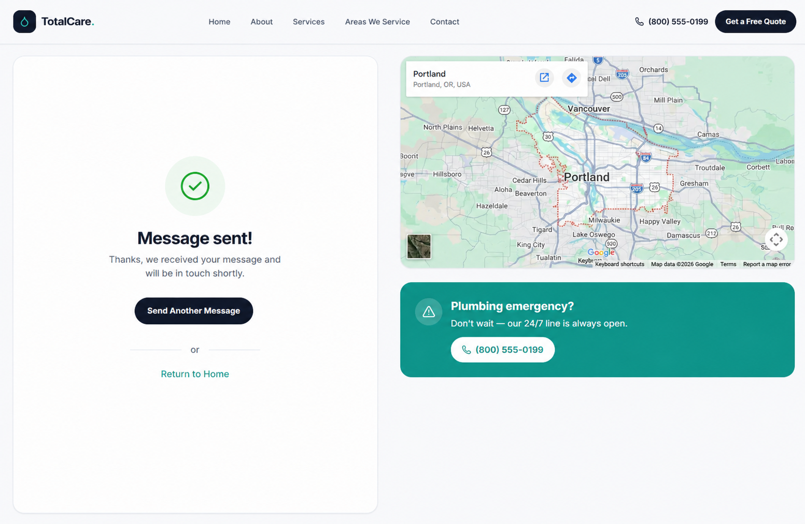
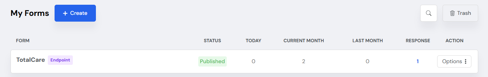
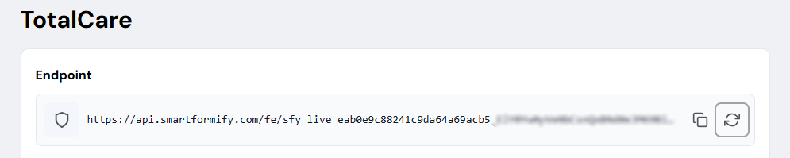
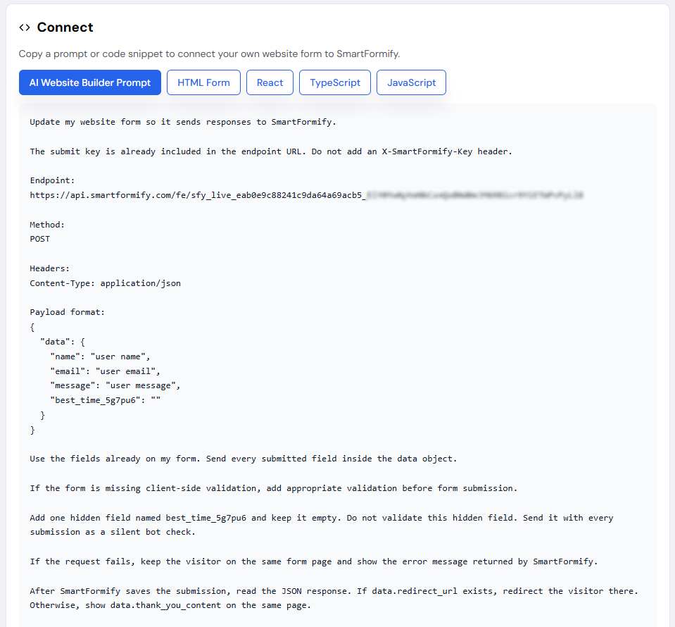
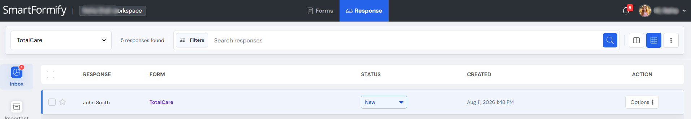

# Form Backend for Any Website Built with Emergent

> **A streamlined guide for integrating your AI-generated website forms with Smartformify.**

If your contact form encounters an error after generating your application with Emergent AI, the form simply lacks a designated backend endpoint to route and capture user submissions.

This guide details how to pair your frontend interface with **Smartformify** to deliver reliable, centralized message management.

---

## 📖 Before vs. After Integration

### ❌ Default State: Disconnected Form Pipeline

While your website may look complete and polished, form submissions can still fail if the form does not have an active endpoint to receive the submitted data.

### Before Connecting SmartFormify

The website looks ready to use, but the form submission is not yet connected to a working destination.

  
  &nbsp;&nbsp;
  
  &nbsp;&nbsp;
  

When a user triggers **Submit**, the application will:

* Throw unhandled submission errors
* Fail silently without visual feedback
* Drop payload transmissions
* Result in permanent lead data loss

> ⚠️ **Configuration Notice**
>
> The contact form is unlinked; incoming visitor telemetry and inquiries will not be captured.

  

---

### ✅ Production-Ready State: Fully Functional Data Flow

Linking your form actions to **Smartformify** establishes an instant, robust pipeline for capturing client responses.

Once configured:

* ✅ Submissions go through successfully
* ✅ Form details send instantly
* ✅ Data saves and organizes automatically
* ✅ Messages are easy to track in one central dashboard

  
  &nbsp;&nbsp;
  

> 💡 **Deployment Ready**
>
> Your form interface is fully integrated and ready to ingest live user inquiries.

---

# 🚀 Step-by-Step Setup

## Step 1 — Initialize Your Smartformify Account

Set up your Smartformify workspace to begin generating endpoints.

**[👉 Sign Up for Smartformify](https://www.smartformify.com/signup)**

Once authenticated, navigate to your administrator dashboard.

---

## Step 2 — Provision an API Endpoint

Generate a dedicated submission target:

1. Access your **Smartformify Dashboard**
2. Select **Create an Endpoint**
3. Assign a descriptive identifier to your endpoint
4. Save the configuration
5. Copy the generated **Endpoint URL**

This Endpoint URL acts as the secure webhook target for your Emergent AI application.

> 📋 **Best Practice**
>
> Generate distinct endpoint URLs to isolate data across different forms.

---

## Step 3 — Integrate the Endpoint

Select your preferred deployment method below.

### Option A — Manual Codebase Integration

Locate your form's `action` attribute or API submit handler in your Emergent AI-generated source code, replace the target destination with your **Endpoint URL**, commit the changes, and execute a test submission.

> ✅ **Integration Complete**
>
> Your frontend form is actively transmitting data to Smartformify.

---

### Option B — Automated Integration via Emergent AI Prompt

Prompt the Emergent AI assistant to handle the code update directly.

Copy the prompt below and paste it into your Emergent AI chat interface:

Once the AI completes the update, trigger a test submission to verify the network request.

🤖 Automated Route  
Delegating endpoint injection to the AI engine ensures quick implementation without manual code edits.

📬 Response Management & Analytics  
Connecting your application automatically activates instant email alerts for incoming submissions. You can review, filter, and export all captured user payloads within the Responses tab of your dashboard.

New form submissions will appear automatically.

Incoming transmissions update in real time.

📥 Centralized Data Engine  
Manage all lead ingestions from a unified control panel.

🎉 System Online!  
Your Emergent AI project is configured for production user engagement.

Execution lifecycle:

✅ Instant client-side validation and request processing

✅ Automated payload transmission to Smartformify

✅ Real-time data availability in your dashboard

Your project is ready to capture production traffic.